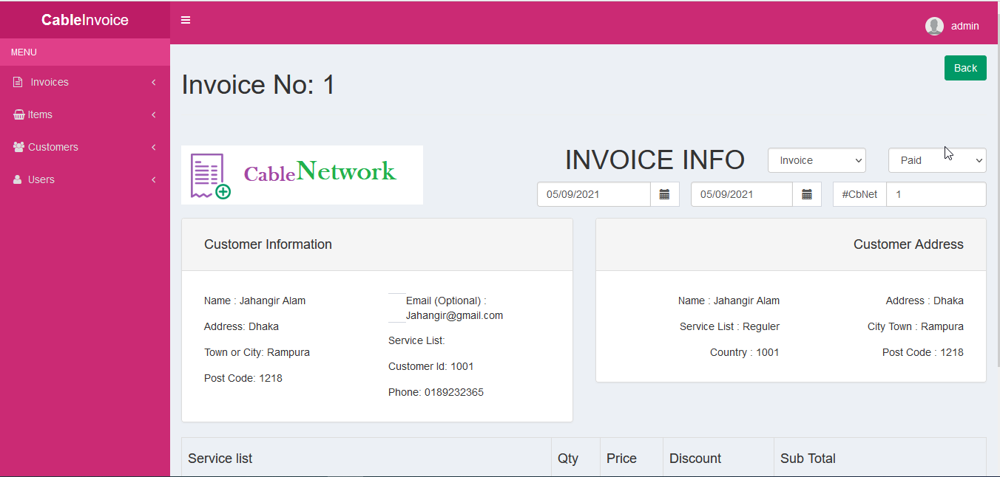

### Invoice Management System

Invoice Management system is a fast cloud based invoicing / billing solution. The system enables you to add products and items, create customers and users, and generate as many invoices, receipts and quotes as you want.

The system provides some other awesome features which include instant invoice calculations for items, quantity, discounts, Taxes / VAT and total without any extra effort.
<h2>Project Screenshots</h2>

<h2>Features</h2>

<ul>
<li>Responsive Designing, easily accessible on different devices.</li>
<li>Generate Invoices and receipts</li>
<li>Unique bill numbers</li>
<li>Functionality to create invoice item each time or choose from database.</li>
<li>Functionality to add and remove TAX.</li>
<li>	Enter shipping details manually or select from database while creating bill</li>
<li>	Send receipts to client's email address</li>
<li>	Generate downloadable PDf and Excel files</li>
<li>	User management: create users to login and use the system</li>
<li> And lot more...</li>
</ul>

<h2>Technology, Tools and Plugin Used</h2>

<ul>
<li>PHP & MySql</li>
<li>Boostrap</li>
<li>JQuery</li>
<li>PHPMailer</li>
<li>TimePicker</li>
<li>ColorPicker</li>
<li>fpdf: To generate Pdf files</li>
</ul>

<h2>Note</h2>
This invoice system can be used for any type of invoicing from general in-house invoicing, e-commerce, to product and services invoicing.
 
